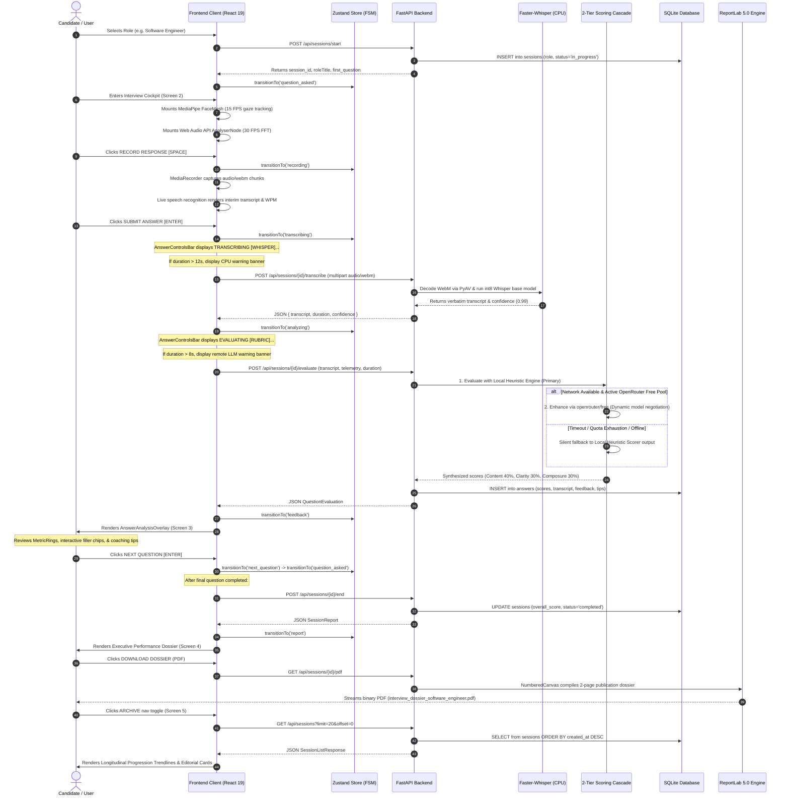

# Interview Lifecycle Data Flow Specification

**Project**: Autonomous AI-Based Interview Simulator (HR Bot)  
**Academic Milestone**: Final Year Project (FYP) 2026  
**Department**: Department of Software Engineering, University of Sindh, Jamshoro  

---

## 1. End-to-End Interview Lifecycle Sequence

---

## 2. Telemetry and State Flow Matrix

| Stage | Input Sensors | Processing Engine | State Target | Output Artifact |
|---|---|---|---|---|
| **`question_asked`** | User role choice | Web Speech TTS (Synthesis) | Local Zustand Store | Question headline & time limit |
| **`recording`** | Webcam + Microphone | MediaPipe FaceMesh + Web Audio FFT | Live Interim Buffer | Real-time gaze coordinates, live WPM, interim transcript |
| **`transcribing`** | WebM Opus Audio Blob | Hugging Face faster-whisper (CPU) | Backend In-Memory | Verbatim text transcript (`confidence > 0.95`) |
| **`analyzing`** | Transcript + Telemetry | Local Heuristic Scorer + OpenRouter | SQLite `answers` Table | Multi-axis scores, praise, and targeted improvement tips |
| **`feedback`** | Evaluator payload | React 19 UI DOM | Transient Modal Overlay | Color-coded transcript with clickable filler popovers |
| **`report`** | Aggregated answer metrics | Chart.js 5-Axis Radar + SVG Trendline | SQLite `sessions` Table | Composite Index, Readiness Tier (`STRONG`, `DEVELOPING`), PDF |
| **`history`** | Paginated DB query | Zustand Persistent Cache | Standalone History View | Dual-line SVG progression chart, per-question sparklines |
