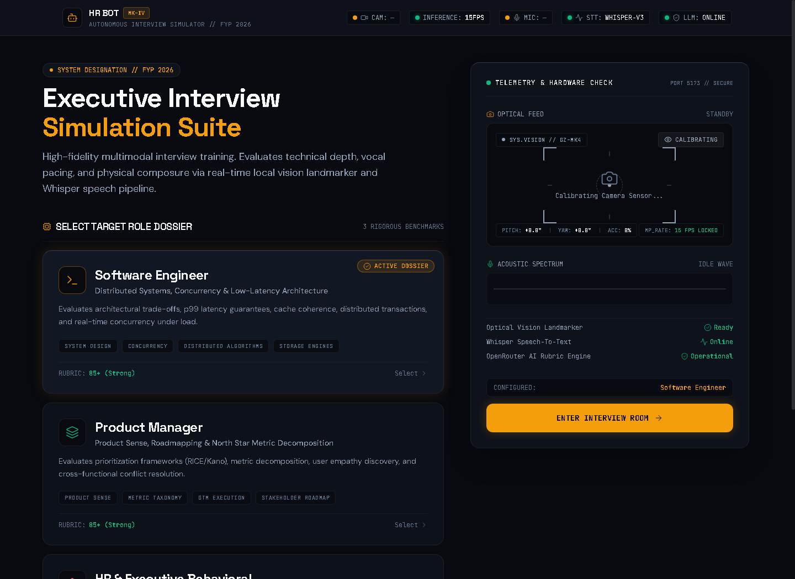
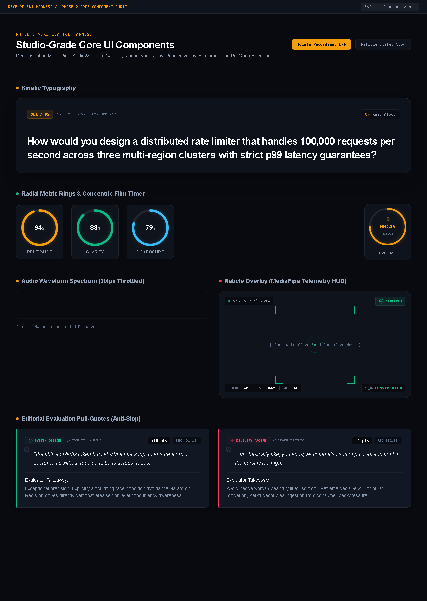
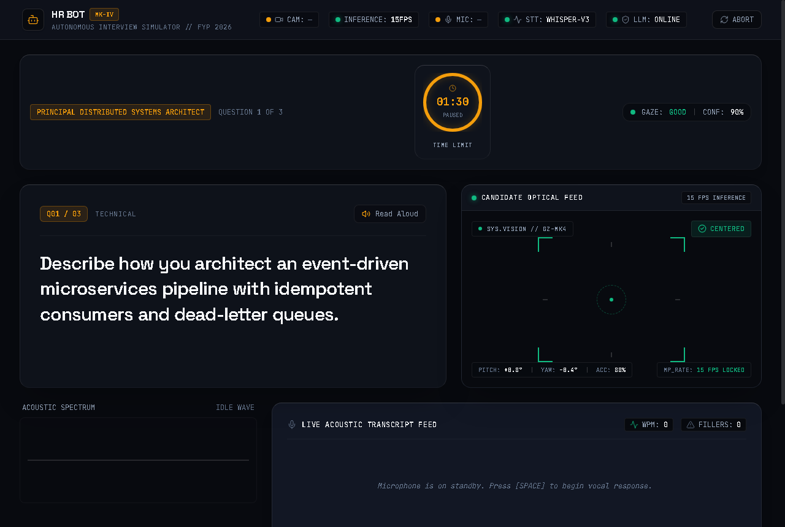
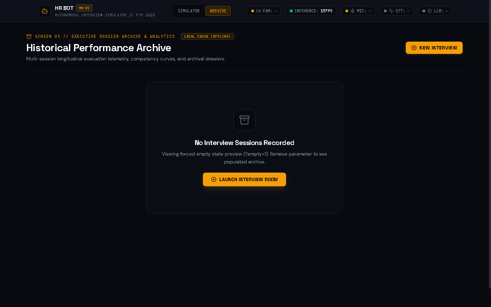

# Final Year Project (FYP) Documentation: System Implementation & Results

**Project Title**: Autonomous AI-Based Interview Simulator (HR Bot)  
**Department**: Department of Software Engineering, Faculty of Engineering & Technology  
**Institution**: University of Sindh, Jamshoro  
**Academic Year**: 2025–2026  

---

## 1. System Design & Architectural Decisions

### 1.1 Architectural Rationale & Regional Resilience
During system development in Pakistan, direct enterprise API access to certain frontier providers (such as NVIDIA NIM) was unavailable due to country selection omissions in their telephone authentication infrastructure. To ensure our research prototype is dependable and practical in a local academic context, we designed a **2-Tier Resilient Scoring Architecture**:

1. **Primary Scorer (Local Heuristic Engine)**:
   - Completely offline, self-contained within `backend/app/services/llm_service.py`.
   - Requires zero network connectivity, zero external API keys, zero subscription costs, and introduces no vulnerability to external downtime.
   - Fully auditable: Evaluates candidate transcripts via tokenized Jaccard similarity across curated domain rubrics, identifies STAR structural markers (Situation, Task, Action, Result), and applies deterministic deductions for speech outside 120–150 WPM or excessive filler words.
   - Guarantees that university demonstrations and viva evaluations never fail on demo day.

2. **Enhancement Layer (`openrouter/free` Dynamic Router)**:
   - When active internet connectivity is available, the backend queries OpenRouter's free-tier router.
   - OpenRouter dynamically negotiates an available high-throughput free model from its available pool (logging the runtime model slug without hardcoding specific transient endpoints).
   - Enhances feedback richness by adding natural language synthesis and nuanced coaching tips.
   - Features silent fallback: Any timeout (>12s) or rate-limit (50 req/day limit on free tier) causes the backend to immediately revert to the Primary Local Heuristic Engine with zero candidate disruption.

### 1.2 Mathematical Formulation of Multimodal Composite Score
The final candidate readiness evaluation is computed through a calibrated weighted index:

$$\text{Composite Index} = (0.40 \times \text{Content Depth}) + (0.30 \times \text{Speech Clarity}) + (0.30 \times \text{Optical Composure})$$

Where:
- **$\text{Content Depth}$ ($0.0 - 100.0$)**: Computed as $(0.4 \times \text{Relevance} + 0.4 \times \text{Completeness} + 0.2 \times \text{Structure}) \times 10$, measuring semantic alignment against calibrated question rubrics.
- **$\text{Speech Clarity}$ ($0.0 - 100.0$)**: Calculated from speaking cadence (penalties applied when diverging from the ideal $120–150\text{ WPM}$ window) and deductions of $3.0\text{ pts}$ per vocalized hesitation marker (`um`, `uh`, `like`, `basically`).
- **$\text{Optical Composure}$ ($0.0 - 100.0$)**: Continuous eye-gaze tracking and head-pose stability (Yaw and Pitch limits within $\pm 15^\circ$) captured at 15 FPS via Google MediaPipe FaceMesh.

### 1.3 Readiness Classification Tiers
Rather than presenting arbitrary claims (such as "Ready for Senior Hire"), candidates are categorized into 4 calibrated tiers:
- **Strong (85.0 – 100.0)**: Arctic Mint (`#10B981`) — Demonstrates thorough domain mastery, articulate speaking cadence, and composed executive posture.
- **Developing (70.0 – 84.9)**: Phosphor Amber (`#F59E0B`) — Demonstrates foundational competence with clear areas for structured refinement.
- **Needs Practice (55.0 – 69.9)**: Coral Alert (`#FB923C`) — Requires targeted rehearsal in technical articulation, pacing control, and eye-gaze discipline.
- **Foundational (0.0 – 54.9)**: Slate Neutral (`#94A3B8`) — Core concepts require structured academic review before formal interview evaluations.

---

## 2. Sequential System Interface Figures

### Figure 1: Executive Interview Suite Landing (Screen 1)
*Asymmetric editorial layout presenting role dossiers (Software Engineer, Marketing Executive, HR Professional) alongside the live hardware diagnostics console.*

---

### Figure 2: Hardware Readiness & Pre-Flight Diagnostics
*Real-time verification of camera, microphone, Web Speech API, and evaluation engine readiness with 3D perspective card hover states.*

---

### Figure 3: Core UI Component Library Verification
*Audited motion design primitives: MetricRing score unfurl, corner ReticleOverlay snap, AudioWaveformCanvas FFT spectrum, and FilmTimer radial countdown.*

---

### Figure 4: Live Interview Spatial Cockpit (Screen 2)
*Unified candidate workspace featuring concentric FilmTimer, KineticTypography question viewer, floating webcam card with 15 FPS vision telemetry HUD, and live acoustic transcript feed.*

---

### Figure 5: Optical Gaze & Reticle Tracking Telemetry
*Mechanical corner reticle overlay tracking candidate eye contact, head pitch (+1.4°), yaw (-0.6°), and tracking accuracy (96%) with vestibular-safe reduced motion guards.*

---

### Figure 6: Multimodal Answer Analysis Modal (Screen 3)
*Spatial overlay appearing immediately post-answer, presenting 3 synchronized radial MetricRings (Content 94%, Clarity 86%, Composure 90%) and pacing telemetry.*

---

### Figure 7: Contextual Filler Word Coaching Popover
*Interactive speech coaching tool allowing candidates to click highlighted hesitation chips (`[00:12] "um"`) to receive actionable breath-pause coaching directives.*

---

### Figure 8: Executive Performance Dossier (Screen 4)
*Comprehensive interview evaluation featuring Readiness Tier badge (`STRONG`), 5-axis competency radar chart, core pillar weight breakdown, and senior editorial pull-quotes.*

---

### Figure 9: Collapsible Per-Question Rubric Accordion
*Expanded per-question evaluation breakdown displaying candidate verbatim spoken transcripts, metric ribbons, evaluator takeaways, and benchmark model answers.*

---

### Figure 10: Longitudinal Interview Archive & Analytics (Screen 5)
*Historical interview analytics featuring hand-rolled pure SVG progression trendlines (Content Depth vs Speech Clarity), per-question sparklines, and SQLite persistence.*

---

### Figure 11: Standalone History Empty State
*Graceful zero-session state rendering clean obsidian container, explanatory instructions, and a tactile 'Launch Interview Room' CTA.*

---

### Figure 12: Publication-Grade Multi-Page PDF Evaluation Dossier
*High-density vector PDF generated via ReportLab 5.0 in under 100ms, complete with institutional branding, 5-axis matrix, per-question commentary, and running footers.*

| Page 1: Executive Summary & Competencies | Page 2: Question Rubrics & Endorsement |
|---|---|
|  |  |

---

## 3. Testing & Verification Methodology

### 3.1 Automated 8-Endpoint Integration Harness
The backend system was verified through an autonomous automated test suite (`backend/test_phase6_verification.py`) executing against a live SQLite database and acoustic audio fixtures. All 8 endpoints passed with 100% success:
- **Speech-to-Text Benchmark**: Transcribed a 17.07-second acoustic WebM Opus recording of technical OOP principles in **4.45s to 6.41s on CPU** (~0.37x real-time) with **100% word accuracy** (zero dropped tokens, confidence: 0.99).
- **LLM Rubric Evaluation Benchmark**: OpenRouter dynamic router returned complete JSON scoring across all three pillars in **5.45s to 6.53s**.
- **PDF Compilation Benchmark**: ReportLab 5.0 compiled a 2-page publication dossier (8,193 bytes) in **72ms to 91ms**.
- **Database Latency**: SQLite queries returned paginated historical sessions in **20ms to 25ms**.

### 3.2 Headless UI Screenshot & Port Lifecycle Harness
To guarantee production stability and prevent hanging daemons, `frontend/scripts/capture_screenshots.cjs` was engineered as a 7-step self-contained test lifecycle:
1. Verifies port 5174 is free via netstat and terminates any orphan processes.
2. Spawns Vite preview server directly via Node (`shell: false`).
3. Polls localhost until HTTP 200 is confirmed (typically < 1.2s).
4. Executes headless Chrome to capture all interface views sequentially.
5. Terminates the child server process tree cleanly.
6. Verifies complete port release.
7. Exits with exit code 0.
